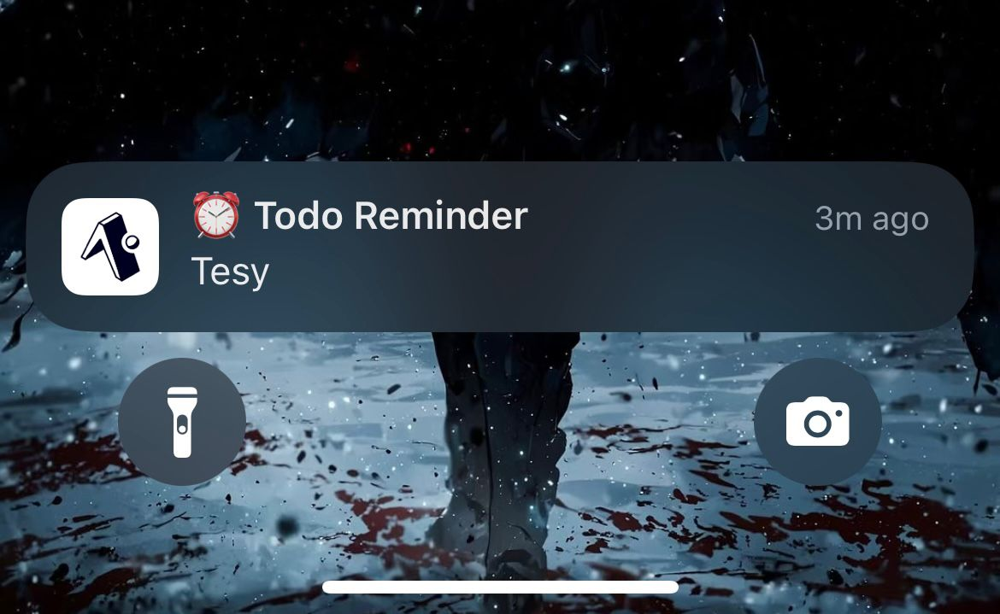
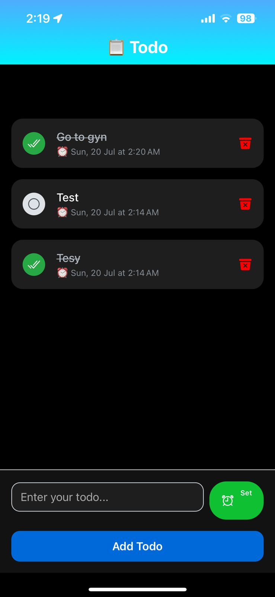
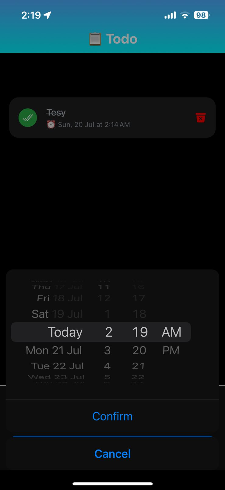

# 📝 TodoNative with Notifications

A beautifully designed cross-platform **React Native Todo App** with built-in **local push notifications**, built using the **Brastull MERN Stack** (MongoDB, Express.js, React Native, Node.js).

> Stay organized and never miss a task again — get notified exactly when you need it!

---

## 🚀 Features

- ✅ Create, edit, and delete todos
- ⏰ **Schedule local notifications** (powered by Expo)
- 🌗 Light/Dark theme support
- 📲 Responsive design across Android and iOS
- 💾 Persisted with **MongoDB** via **Express + Node.js API**
- 🔔 Notification permissions and fallback handling
- ⚡ Smooth UI with optimized FlatList and custom components

---

## 📸 Screenshots

<div style="display: flex; flex-wrap: wrap; gap: 10px; justify-content: center;">

  
  
  

</div>

---

## 🧱 Tech Stack

### Frontend (Mobile)

- [React Native](https://reactnative.dev/)
- [Expo](https://expo.dev/)
- [TypeScript](https://www.typescriptlang.org/)
- [Redux Toolkit](https://redux-toolkit.js.org/)
- [Expo Notifications](https://docs.expo.dev/versions/latest/sdk/notifications/)
- [React Navigation](https://reactnavigation.org/)

### Backend (Brastull Stack)

- [Node.js](https://nodejs.org/)
- [Express.js](https://expressjs.com/)
- [MongoDB Atlas](https://www.mongodb.com/cloud/atlas)
- [Mongoose](https://mongoosejs.com/)

---

## ⚙️ Installation & Setup

### 🔧 Prerequisites

- Node.js & npm
- MongoDB Atlas (or local MongoDB)
- Expo CLI: `npm install -g expo-cli`

---

### 🖥️ Backend (API)

```bash
cd backend
npm install
npm run dev
```
